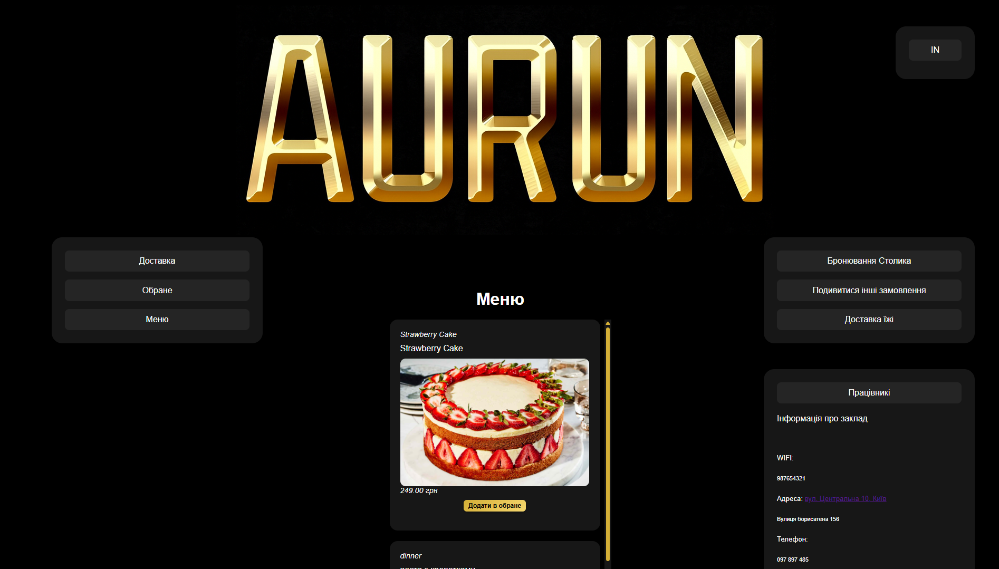
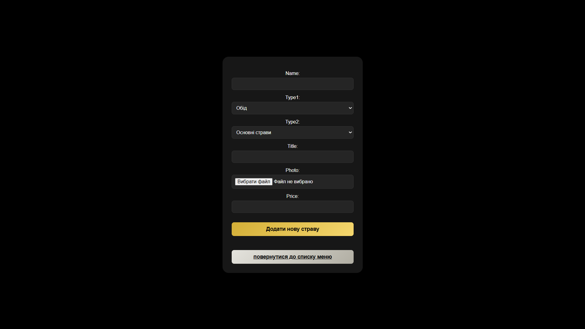
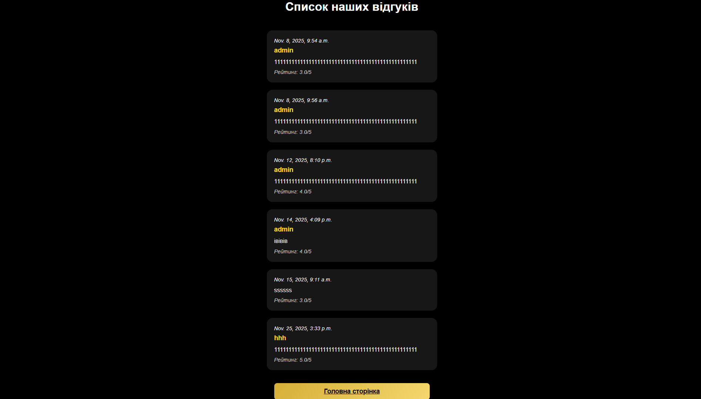
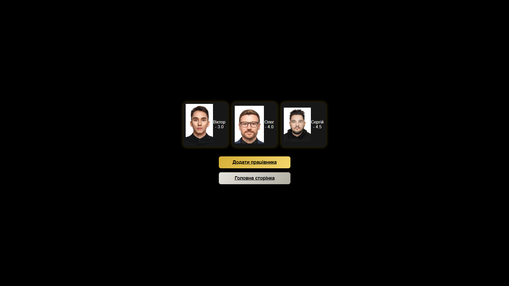
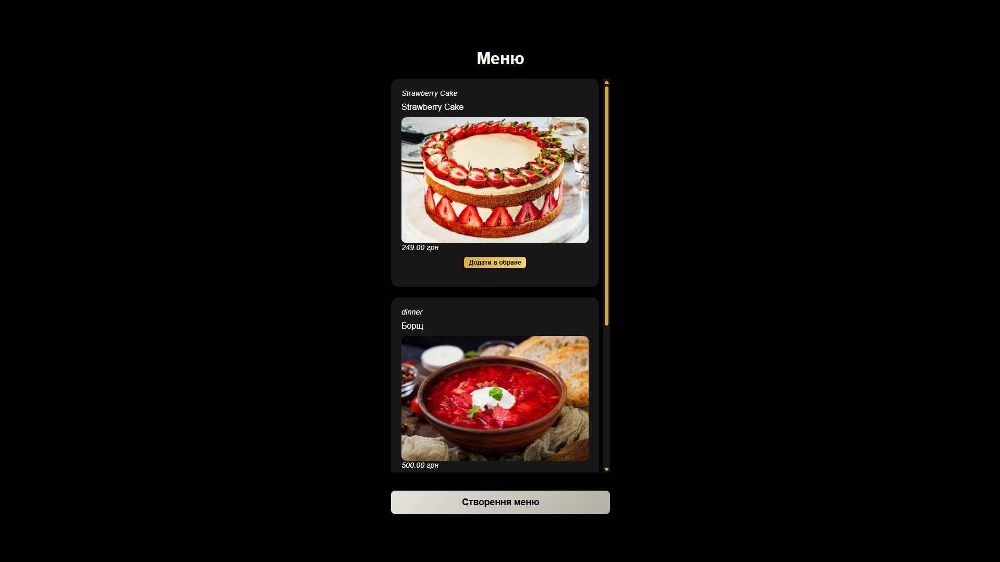
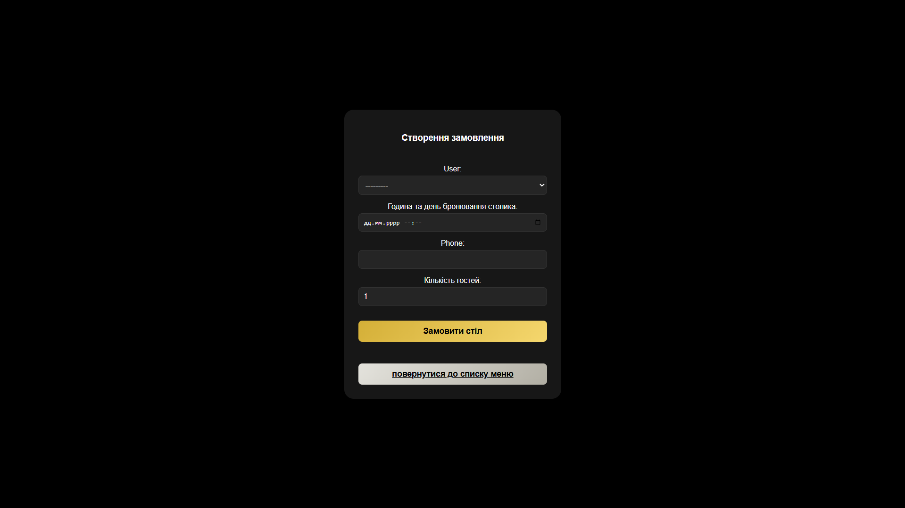
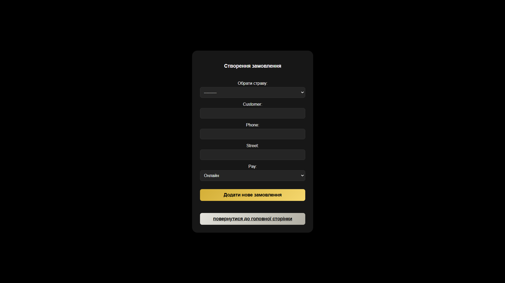
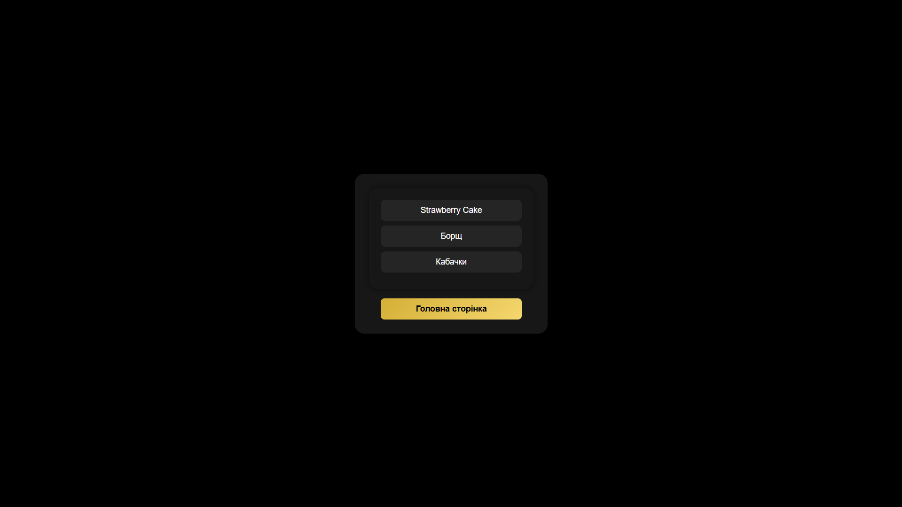

# 🍽 Restaurant Website


This Django-based web application is designed for users who want to enjoy delicious food and leave reviews.
Clients can browse dishes, read reviews, view staff members, and access additional information about the restaurant.
They can add dishes to their favorites, place table reservations, order dishes, and submit their own reviews with ratings from 1 to 5.
The application also includes an administrator role with extended functionality, allowing them to manage and approve or reject orders and reservations.

## 🔧 Features

### 👤 User Features
- User registration and authentication
- Browse existing menu and staff
- View and create reviews
- Make table and food orders
- View staff members and their ratings
- View favorite dishes and additional information

### 🛠 Admin Features
- View everything a regular user can access
- Add staff members
- Approve table reservations and food delivery orders
- Add and edit the menu

## 📆 Task & Resume Management
- Ability to leave reviews and ratings (1–5)
- View working hours
- Browse staff members and their ratings
- Add dishes to favorites

## 🛠 Tech Stack
- Backend: Django (Python)
- Database: SQLite
- Frontend: HTML, CSS, JavaScript (Django Templates)
- Authentication: Django built-in auth system with a custom user model
- Version Control: Git

## 🚀 Installation

1. **Clone the Repository**:

    ```bash
    git clone https://github.com/DanyaStorozhuk/My_final_projec_logika.git
    cd My_final_projec_logika
    ```

2. **Set Up a Virtual Environment**:

    ```bash
    python -m venv venv
    source venv/bin/activate  # On Windows: venv\Scripts\activate
    Install Dependencies:
    ```

3. **Install Dependencies**:

    ```bash
    pip install -r requirements.txt
    ```

4. **Apply Migrations**:

    ```bash
    python manage.py makemigrations
    python manage.py migrate
    ```

5. **Create a Superuser (Optional)**:

    ```bash
    python manage.py createsuperuser
    ```

6. **Run the Development Server**:

    ```bash
    python manage.py runserver
    ```


Access the application at http://127.0.0.1:8000

## 📂 Project Structure
main/                 # Main Django app — handles core features: workers, reviews, menu, food delivery, reservations.

my_final_project/     # Django project configuration (settings, urls, wsgi, asgi)

media/                # User-uploaded files (images, uploads)

templates/            # HTML templates (Django Templates)


## 🧱 Models
- Restaurant – stores general information about the restaurant
- Comment – user reviews, including author, text, date, and rating
- Worker – staff members and their details (role, photo, name, etc.)
- Menu – menu items with image, price, name, and description
- MenuOrder – food delivery orders (customer name, address, phone number, payment method, etc.)
- CustomUser – custom user model with extended user information
- Order – table reservations (customer name, time, phone number, number of guests, etc.)


## 🌐 URL Overview
/ – Home page

/start_page/ – Start page

/not_login_user/ – Page for unauthorized users

👤 Authentication

/register/ – User registration

/login/ – User login

🏠 Restaurant

/restauran/ – Restaurant information page

/more_info/ – Additional restaurant information

🍽 Menu

/menu/list/ – Menu items list

/menu_create/ – Create a new menu item (admin)

/menu/<id>/special/ – Mark a menu item as special

/special/ – List of special menu items

👨‍🍳 Staff

/workers/list/ – Staff list

/workers/ – Create a staff member (admin)

⭐ Reviews

/reviews/ – Create a review

/reviews/list/ – Reviews list

📦 Orders

/order/ – Table reservations list (admin)

/order/user/ – Create a table reservation

/order/<id>/update/ – Update table reservation status (admin)

🍔 Food Orders

/orderfood/ – Food orders list (admin)

/order/<id>/update/foood/ – Update food order status (admin)

/order_menu/ – Create a food order

👤 Users

/customuser/ – Create a custom user (admin)

## 🔮 Future Improvements
-    Expand restaurant functionality
- Improve code readability and project structure
- Add menu filtering by category, price, or popularity
- Implement dish search by name or ingredients
- Enable online table reservations with date and time selection
- Add notification system (email) for order and reservation confirmations
- Implement staff rating and review system
- Introduce user role separation (admin, staff, customer)
- Add order history for users
- Integrate online payment system
- Create an admin dashboard with analytics (popular dishes, orders, staff ratings)
- Add multi-language support (Ukrainian / English)

## Screenshots

### Homepage


### Create Menu Page


### List Page


### List Workers Page


### Menu Page


### Order Table Page


### Order Page


### Special Page



## 📌 Author
Danya Storozhuk
GitHub: https://github.com/DanyaStorozhuk
